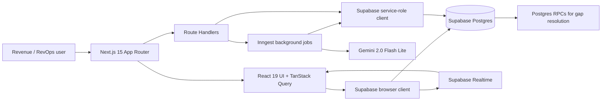

# DataSignalGTM

DataSignalGTM is an AI-assisted GTM command center for teams that need to turn noisy account data into trusted sales motion. It combines account data quality scoring, realtime buyer signals, ICP prioritization, approval workflows, and Gemini-generated outreach playbooks in a single Next.js application.

The product direction is simple: every rep should know which accounts are ready, why they are ready now, what data needs fixing, and what action to take next.

## What It Does

- Scores account data quality and ICP fit so RevOps can see which accounts are usable for outbound motion.
- Tracks buyer signals with a strict status machine: pending, held, approved, and rejected.
- Queues AI playbook generation through Inngest, then validates Gemini output with Zod before saving.
- Syncs account, signal, and data issue changes in realtime through Supabase Realtime.
- Provides a focused dashboard for approving or rejecting signals, resolving data gaps, and copying account-specific intros.

## Architecture



## Tech Stack

- Framework: Next.js 15 App Router, React 19, TypeScript strict mode
- Data: Supabase Postgres, Supabase SSR, Realtime, RPCs
- Client state: TanStack Query v5 with optimistic mutations
- AI: Gemini via `@google/generative-ai`, orchestrated with Inngest background jobs
- Validation: Zod for API payloads and runtime environment checks
- Styling: Tailwind CSS 4 with Radix/shadcn-compatible primitives
- Quality: ESLint, Prettier, Vitest, React Testing Library, Husky, lint-staged, commitlint

## Local Development

### Prerequisites

- Node.js 18.18 or newer
- npm
- Supabase CLI
- A Gemini API key if you want live playbook generation

### Setup

```bash
npm install
cp .env.local.example .env.local
```

Fill in the Supabase and Gemini values in `.env.local`. For local background jobs, run the Inngest dev server and point it at the app's `/api/inngest` endpoint.

```bash
npx inngest-cli@latest dev -u http://localhost:3000/api/inngest
```

### Run With The Hosted Supabase Project

```bash
npm run dev
```

Open [http://localhost:3000](http://localhost:3000).

### Run With Supabase Local

Start Supabase locally:

```bash
supabase start
```

Apply migrations and seed data:

```bash
supabase db reset
```

Copy the local API URL and anon key from the Supabase CLI output into `.env.local`, then start the app:

```bash
npm run dev
```

The current migrations include demo accounts, signals, data issues, and RPCs for data quality gap resolution.

### Authentication Setup

Phase 1 protects the application with Supabase Auth and organization-scoped RLS.

For local development:

1. Run the migrations with `supabase db reset`.
2. Sign in with `demo@datasignalgtm.local` from `/login`.
3. Open the local Supabase email inbox from the CLI output and follow the magic link.

For hosted Supabase:

1. In Supabase Dashboard, open Authentication > Providers.
2. Enable Email provider and Magic Link sign-ins.
3. Enable Google provider, then add your Google OAuth client ID and secret.
4. Add redirect URLs for each environment, for example:
   - `http://localhost:3000/auth/callback`
   - `https://your-production-domain.com/auth/callback`
5. Confirm `SUPABASE_SERVICE_ROLE_KEY` is set only in server environments. It is required for first-login workspace creation and demo reset tools.

## Environment Variables

| Variable | Required | Scope | Description |
| --- | --- | --- | --- |
| `NEXT_PUBLIC_SUPABASE_URL` | Yes | Browser and server | Supabase project URL. |
| `NEXT_PUBLIC_SUPABASE_ANON_KEY` | Yes | Browser and server | Public anon key used by RLS-aware clients. |
| `SUPABASE_SERVICE_ROLE_KEY` | Server routes only | Server | Privileged key for server-side admin operations. Never expose it to the browser. |
| `GEMINI_API_KEY` | Optional | Server | Enables AI playbook generation. Missing values mark queued jobs as failed with a clear message. |
| `INNGEST_EVENT_KEY` | Hosted jobs | Server | Lets the app send events to Inngest outside local dev. |
| `INNGEST_SIGNING_KEY` | Hosted jobs | Server | Lets Inngest securely invoke `/api/inngest` in deployed environments. |
| `DEMO_RESET_KEY` | Optional | Server | Enables protected demo reset tooling. |
| `NEXT_PUBLIC_SENTRY_DSN` | Optional | Browser + server | Sentry DSN for error tracking and performance monitoring. |
| `SENTRY_AUTH_TOKEN` | CI/CD only | Build step | Authorises Sentry CLI source-map uploads. |
| `NEXT_PUBLIC_POSTHOG_KEY` | Optional | Browser | PostHog project API key for product analytics. |
| `NEXT_PUBLIC_POSTHOG_HOST` | Optional | Browser | PostHog host, defaults to `https://us.i.posthog.com`. |
| `FEATURE_FLAGS` | Optional | Server | JSON object overriding individual feature flags. |
| `NEXT_PUBLIC_STRIPE_PUBLISHABLE_KEY` | Billing | Browser | Stripe publishable key. |
| `STRIPE_SECRET_KEY` | Billing | Server | Stripe secret key for checkout, portal, and webhook verification. |
| `STRIPE_WEBHOOK_SECRET` | Billing | Server | Stripe webhook endpoint secret (from `stripe listen` or Dashboard). |
| `STRIPE_PRO_PRICE_ID` | Billing | Server | Stripe Price ID for the Pro tier subscription. |
| `NEXT_PUBLIC_APP_URL` | Billing | Browser+Server | App base URL for Stripe success/cancel redirects. |
| `SIGNAL_WEBHOOK_SECRET` | Webhook | Server | Bearer token securing `POST /api/webhooks/signals`. |

## Scripts

```bash
npm run dev          # Start the Next.js dev server
npm run lint         # Run ESLint
npm run typecheck    # Run TypeScript without emitting files
npm run test:run     # Run Vitest once
npm run build        # Create a production build
npm run ci           # Lint, typecheck, test, and build
```

## Screenshots And GIFs

Add product media here as the UI stabilizes:

- Dashboard overview with DQ, ICP, and recent signal cards.
- Signal approval flow with queued playbook generation and realtime progress.
- Data issue resolution flow showing score impact.
- Realtime sync demo across two browser sessions.

## Testing Strategy

The first test layer focuses on behavior with high regression risk:

- Signal status machine invariants.
- Approval and rejection transition guards.
- Component rendering for shared status UI.

Future phases should add API route tests, Supabase policy tests, and end-to-end flows for auth, org isolation, and AI job processing.

## Security Notes

Phase 1 replaces the original public demo policies with organization-scoped RLS. Application rows now carry `org_id`, and policies require an authenticated user with a matching `organization_members` row.

Keep these rules intact:

- Never expose `SUPABASE_SERVICE_ROLE_KEY` to the browser or any `NEXT_PUBLIC_*` variable.
- Use Supabase Auth user IDs and `organization_members` for authorization. Do not authorize from user-editable metadata.
- Treat seeded demo data as demo-only unless it is moved into a real customer organization.

## Connection Pooling

In production on Vercel, serverless functions can open many concurrent Postgres connections. To avoid exhausting the connection limit:

1. In Supabase Dashboard → Project Settings → Database, copy the **Transaction pooler** connection string (port 6543).
2. Set `SUPABASE_DB_URL` or configure Supabase SSR to use `?pgbouncer=true` on the pooler URL.
3. Supabase handles pooling internally when you use the `@supabase/ssr` client with environment-level anon/service keys — no additional configuration is needed for the standard Row-Level Security query path.
4. If you add direct Postgres access (e.g. for analytics queries), use `pg` with `max: 1` per function invocation, or use the Supabase Data API which pools automatically.

## Contributing

1. Create a focused branch for each change.
2. Run `npm run ci` before opening a pull request.
3. Use conventional commits, for example `feat: add signal table filters` or `fix: guard invalid signal transitions`.
4. Keep database changes in Supabase migrations and document any RLS implications.
5. Prefer small, reviewable PRs that preserve the dashboard, signal workflow, and demo data path.

## Roadmap

- Phase 0: README, developer tooling, tests, CI, and runtime env validation.
- Phase 1: Supabase Auth, organizations, secure RLS, and multi-tenancy.
- Phase 2: Background AI jobs, richer tables, charts, command palette, and bulk workflows.
- Phase 3: Sentry error tracking, PostHog analytics, AI usage/cost dashboard, database indexes, materialized view, error boundaries, and feature flags.
- Phase 4: Stripe billing (Free/Pro/Enterprise), public marketing homepage, external signal webhook, first-login onboarding modal, and /help docs.
